# Presentación

El propósito del presente manual es servir como guía de uso de la imagen institucional del Laboratorio Nacional de las Ciencias de la Sostenibilidad. Debe tomarse como punto de partida para su posterior aplicación a diversas presentaciones. No es la intención de este documento utilizar terminología rebuscada que confunda a quien lo consulte. Se intenta aquí, producir una referencia al alcance de cualquier persona que permita comprender con facilidad cómo debe ser usado el logotipo institucional.

# Introducción

## El enlace borromeo

Aunque en ocasiones se le llame _nudo_ borromeo, se trata de un enlace, ya que está formado por más de un elemento. El enlace borromeo debe su nombre a la familia italiana que desde el siglo XV lo utilizó en su escudo de armas. El uso de este símbolo en la península italiana parece remontarse a un emblema de la ciudad de Cremona, de donde lo tomó Francesco Sforza para posteriormente otorgarlo a la familia Borromeo, en reconocimiento por su ayuda en la defensa de Milán (ca. 1450).

Al igual que muchas formas y símbolos de la humanidad, es posible encontrar enlaces de este tipo en figuras pertenecientes a distintas culturas y tiempos. El _Valknut,_ por ejemplo, es un símbolo nórdico formado por tres triángulos entrelazados a manera de aros borromeos; se utilizó en Suecia desde el siglo IX.

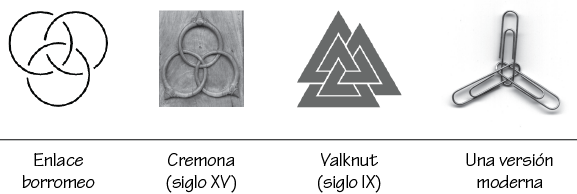

Este enlace tiene la particularidad de que un aro une a los otros dos, es decir, si retiramos uno, los otros dos dejan de estar unidos. Es por esto que se ha usado como representación de la _fuerza mediante la unión._

# El logotipo del LANCIS

Aunque su forma se inspire en elementos orgánicos (guijarros, hojas, gotas de agua), el logotipo es completamente abstracto; sin embargo, retoma la forma topológica de los aros borromeos para aprovechar las múltiples alegorías e interpretaciones que pueden derivarse de esta figura como símbolo de unión. En el ámbito de las Ciencias de la Sostenibilidad hay varias interpretaciones posibles. Tres ámbitos: biológico, económico y social; tres actores: gobierno, sociedad y academia; así como un laboratorio inicialmete conformado por tres unidades de investigación. El logotipo, como ya dijimos, es una abstracción, todas estas interpretaciones no se deducen por sí solas, más bien proveendrán de nuestra propia visión institucional.

Se cuenta con dos versiones principales: el logotipo oficial y la versión extendida con el nombre completo de la institución.

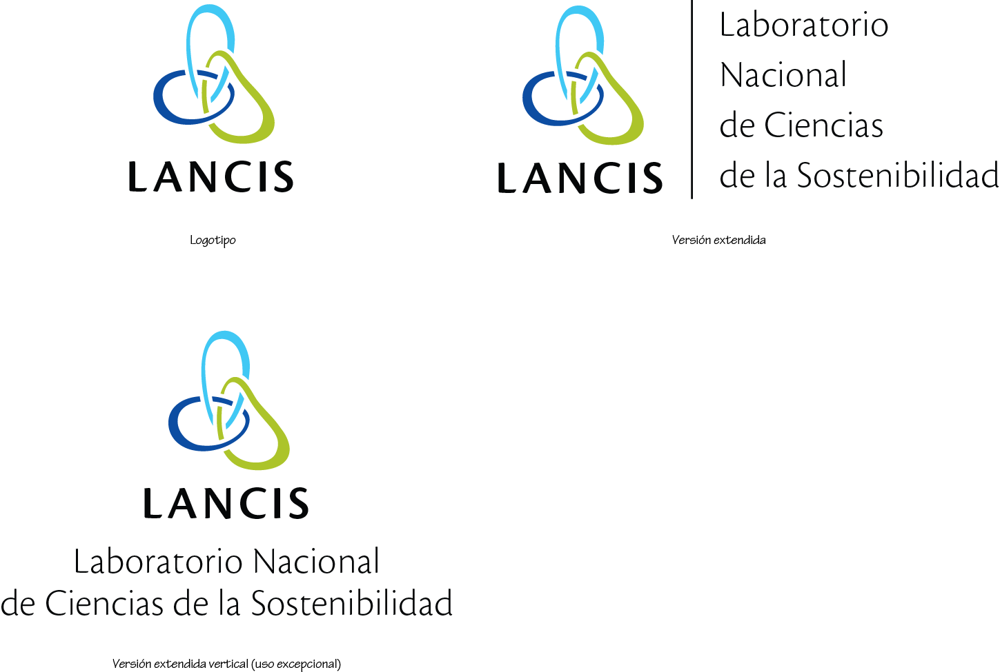

La versión extendida vertical podrá usarse solo cuando la disposición horizontal no convenga a la composición.

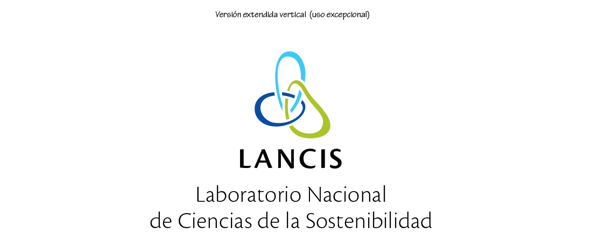

# Elementos y terminología básica

El logotipo esta compuesto por dos elementos inseparables: el símbolo y la tipografía. Es importante comprender esta idea de unidad ya que nunca se presentan dichos elementos por separado.

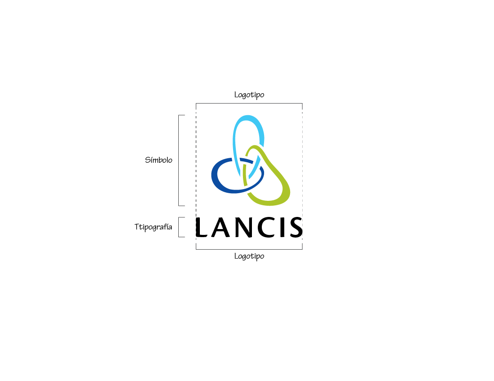

En la versión extendida del logotipo, utilizaremos además, una pleca vertical y otro elemento tipográfico que resulta de poner el nombre completo de la institución.

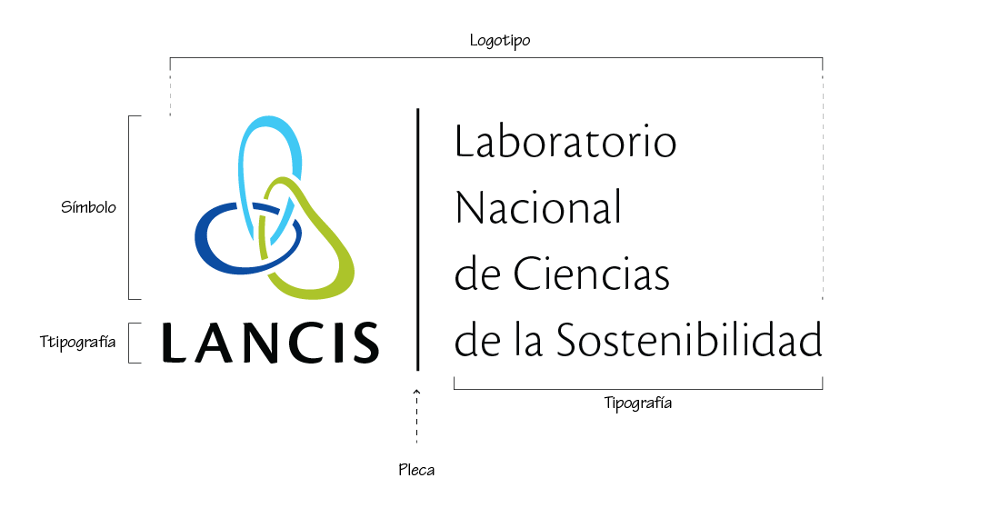

# Colores

Presentamos los valores para cada uno de los principales modelos de color.

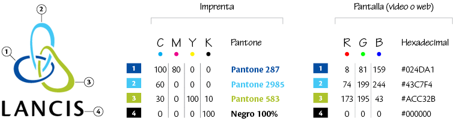

La elección de cada modelo dependerá del destino final que se requiera. En general, el catálogo Pantone y el modelo CMYK (valores de cian, magenta, amarillo y negro), se usan en procesos de impresión; mientras que hexadecimal y RGB (rojo, verde, azul), se usan para desplegar en pantalla.

# Proporciones

Se muestran las proporciones y la retícula de tres versiones del logotipo, tomando como módulo (x) la altura de una mayúscula.

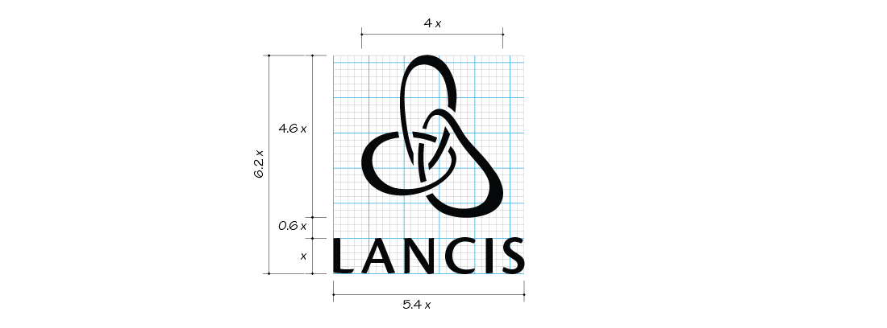

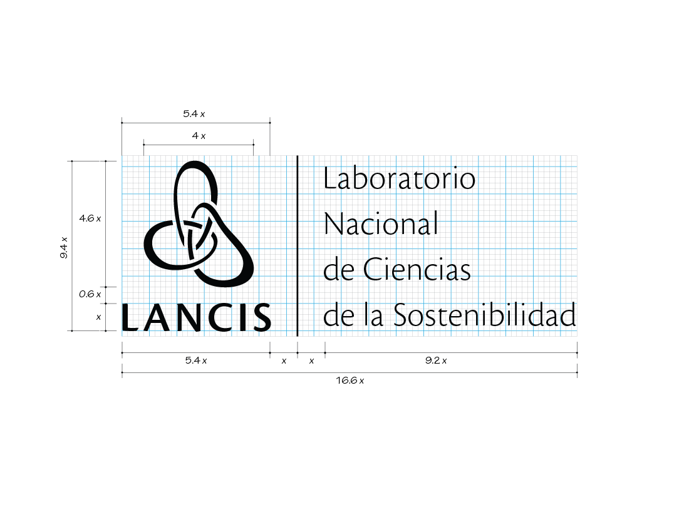

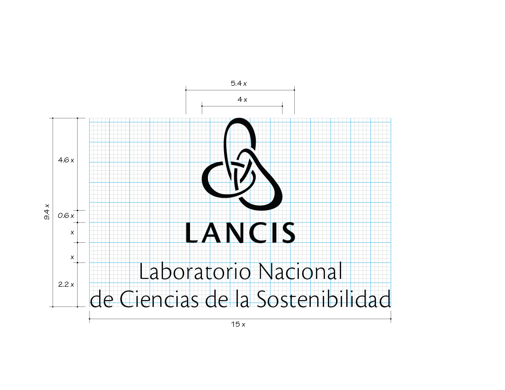

# Área de protección

El área de protección es el espacio mínimo que debe quedar libre alrededor del logotipo, esto con la finalidad de que se lea bien y visualmente no compita cuando se use junto con otros logotipos o elementos de diseño.

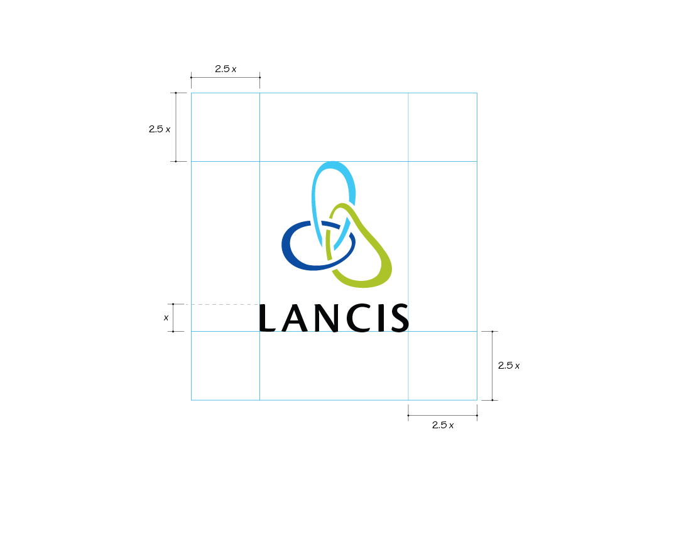

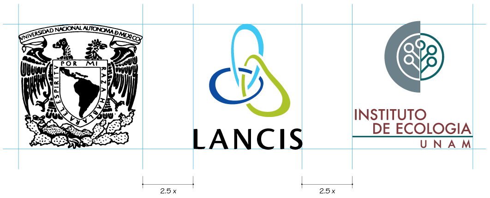

- - -

# Variantes permitidas

Se deberá privilegiar la versión en color sobre fondo blanco y la disposición horizontal.

La versión extendida vertical, como ya se mencionó, será de uso excepcional y podrá usarse solo cuando la disposición horizontal no convenga a la composición.

En casos que así lo requieran, se permitirá el uso de versiones en blanco sobre fondo oscuro (calada).

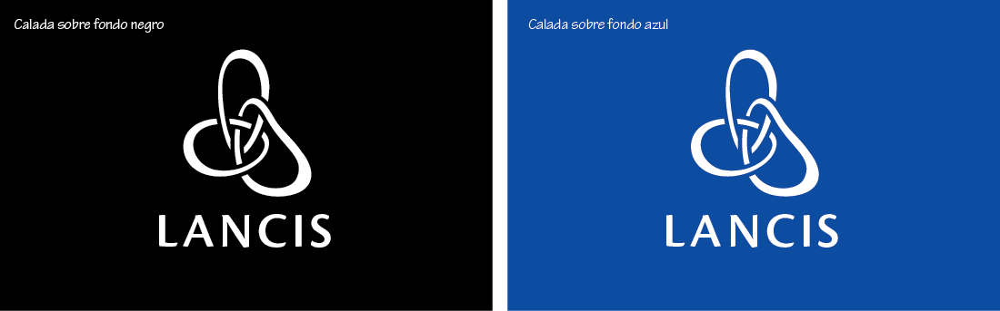

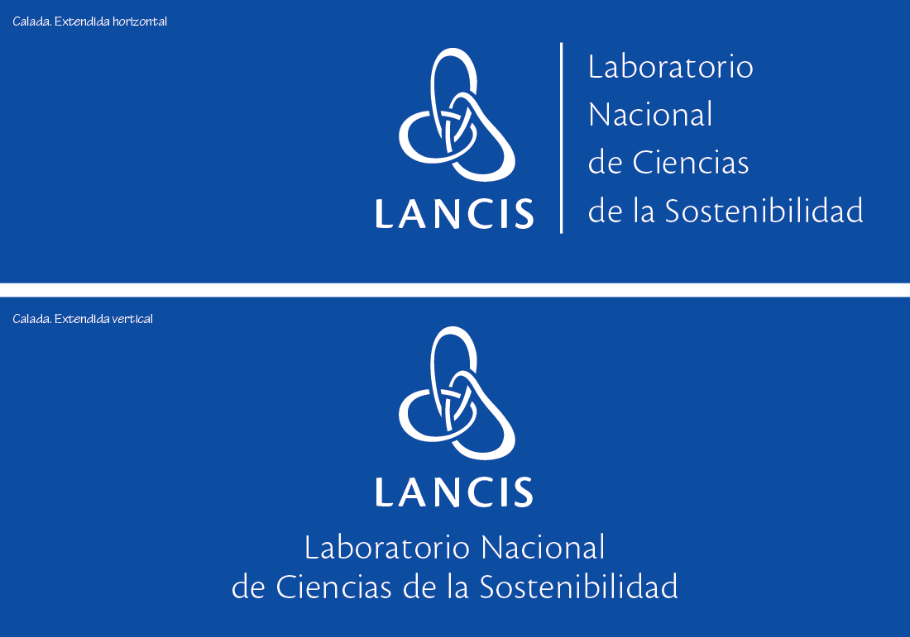

 Asímismo se consideran las variantes monocromáticas en negro sobre fondo claro.

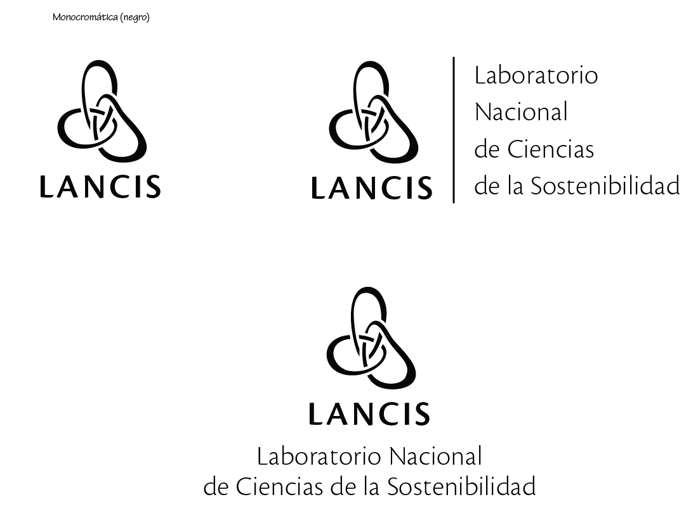

# Usos incorrectos

Parte importante de este manual consiste en especificar qué usos del logotipo **no** están permitidos. A continuación se muestran algunos de los casos más importantes:

- No usar colores en escala de grises ni cambiar o modificar colores
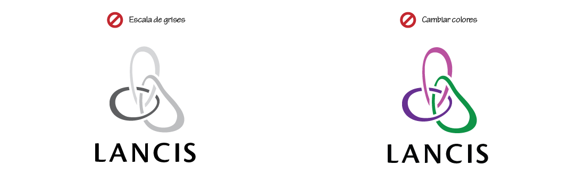

- No modificar proporciones
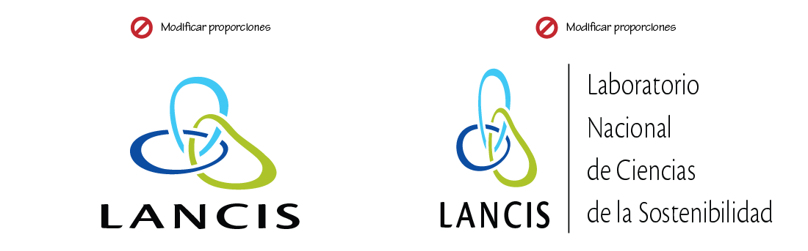

- No inclinar
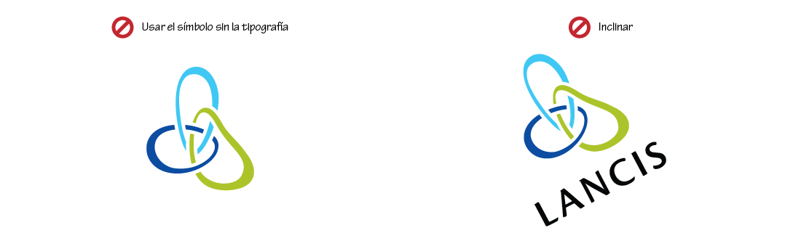

- No usar el símbolo sin la tipografía, modificar la tipografía o cambiar la fuente tipográfica
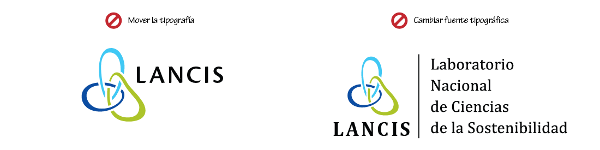

- No añadir elementos (como marcos, plecas, etc.) o agregar sombras o efectos
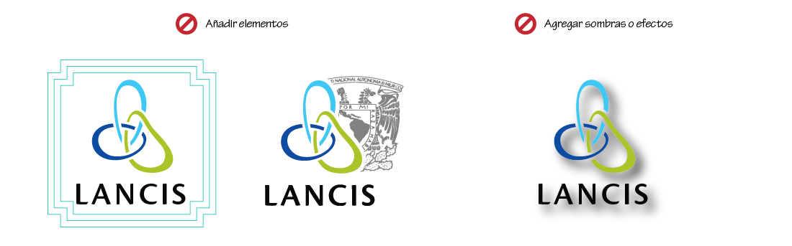

- No usar como patrón repetido o calar sobre un fondo que no sea contínuo
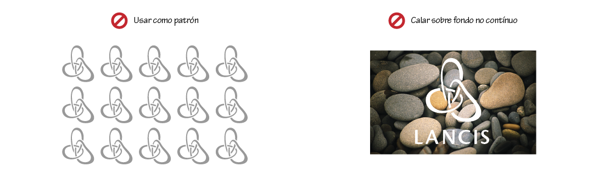

# Fuentes tipográficas

**PENDIENTE** Para la documentación generada por el laboratorio, se propone el uso de dos fuentes tipográficas: Cronos Pro y Chaparral Pro. Mayores detalles sobre su uso correcto se darán en las plantillas propuestas, anexas a este documento.

## Cronos Pro

La fuente Cronos Pro, es una fuente tipográfica en formato OpenType que contiene una gama muy amplia de pesos y variantes. Además de usarse en el logotipo oficial. Se propone su uso en encabezados, figuras, gráficas, mapas y tablas y todo aquello que no sea cuerpo de texto. Deben combinarse los pesos de la siguiente manera: Light - Semibold.  Regular - Bold.

## Chaparral Pro

La fuente Chaparral Pro, es una fuente tipográfica en formato OpenType que contiene una gama muy amplia de pesos y variantes. Se propone su uso en cuerpo de texto. Deben combinarse los pesos de la siguiente manera:

Light - Semibold.  Regular - Bold.
