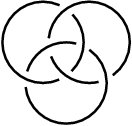
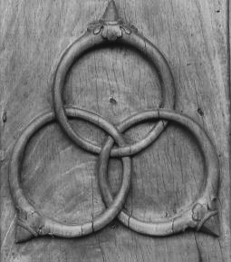
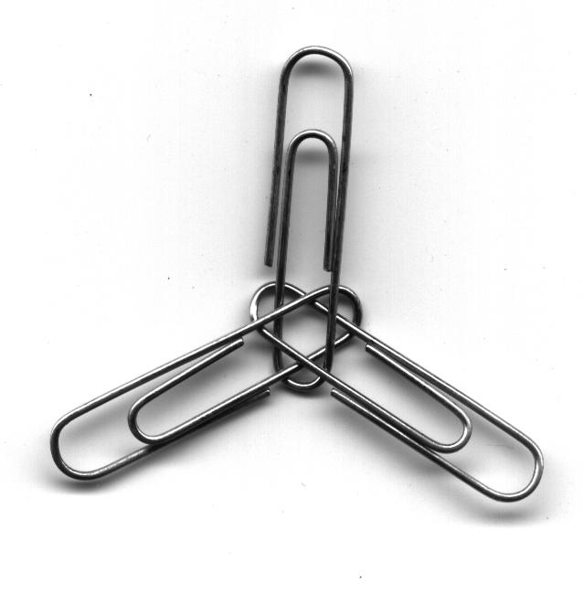

# Presentación

El propósito del presente manual es servir como guía de uso de la imagen institucional del Laboratorio Nacional de las Ciencias de la Sostenibilidad. Debe tomarse como punto de partida para su posterior aplicación a diversas presentaciones. No es la intención de este documento utilizar terminología rebuscada que confunda a quien lo consulte. Se intenta aquí, producir una referencia al alcance de cualquier persona que permita comprender con facilidad cómo debe ser usado el logotipo institucional.

# Introducción

## El enlace borromeo

Aunque en ocasiones se le llame nudo borromeo, topológicamente se trata de un enlace por estar formado de más de un elemento. El enlace borromeo debe su nombre a la familia italiana que desde el siglo xv lo utilizó en su escudo de armas. El uso de este símbolo en la península italiana parece remontarse a un emblema de la ciudad de Cremona, de donde lo tomó Francesco Sforza para posteriormente otorgarlo a la familia Borromeo en reconocimiento por su ayuda en la defensa de Milán (ca. 1450).

Al igual que muchos símbolos de la humanidad, la aparición de este enlace es recurrente en distintas culturas y tiempos; el Valknut, por poner un ejemplo, es un símbolo nórdico formado por tres triángulos entrelazados a manera de aros borromeos utilizado en Suecia desde el siglo IX.

| Enlace  | Cremona (Siglo xv)  | Valknut (Siglo IX) | Una versión moderna  |
|:---:| :---: | :---: | :---: |
|  |  |  |   |

Este enlace tiene la particularidad de que un aro une a los otros dos, es decir, si retiramos uno, los otros dos dejan de estar unidos. Es por esto que se ha usado como representación de la _fuerza mediante la unión._

## El logotipo del LANCIS

Aunque su forma se inspire en elementos orgánicos (guijarros, hojas, gotas de agua), el logotipo del lancis es completamente abstracto, sin embargo, retoma la forma topológica de los aros borromeos y aprovecha las múltiples alegorías e interpretaciones que pueden derivarse de esta figura como símbolo de unión. En el ámbito de las Ciencias de la Sostenibilidad pensamos en varias interpretaciones: tres ámbitos, biológico, económico y social; tres actores, gobierno, sociedad y academia; un laboratorio inicialmete conformado por tres unidades de investigación.
El logotipo, como ya dijimos, es una abstracción, no se pretende que se deduzcan todas estas interpretaciones por sí solas, se trata solo de la visión que deseamos privilegiar y difundir.

- - -

# Terminología básica

El logotipo esta compuesto por dos elementos inseparables: el símbolo y la tipografía. Es importante comprender esta idea de unidad ya que nunca se presentan dichos elementos por separado.

[**FIGURA**]

- - -

# Colores

Existen dos modos principales de representar color: el modelo CMYK, que nos permite imprimir colores; y el modelo RGB, que nos permite verlos en pantalla. El primero son colores pigmento, es decir, las cuatro tintas usadas en los procesos industriales de impresión: cian, magenta, amarillo y negro. El segundo son colores luz, es decir, las tres longitudes de onda primarias del espectro visible por el ojo humano: rojo, verde y azul.
Adicionalmente se incluye la equivalencia en el catálogo Pantone® (Pantone Matching System®), que no es más que un sistema de identificación industrial utilizado en las artes gráficas.

- - -

# Proporciones

Se muestran las proporciones y la retícula tomando como módulo (x) la altura de una mayúscula.
 Área de protección

El área de protección es el espacio mínimo que debe quedar libre alrededor del logotipo, esto con la finalidad de que se lea bien y visualmente no compita cuando se use junto con otros logotipos o algún otro elemento de diseño.
Fuentes tipográficas Pa la documentación generada por el laboratorio, se propone el uso de dos fuentes tipográficas: Cronos Pro y Chaparral Pro. Mayores detalles sobre su uso correcto se darán en las plantillas propuestas, anexas a este documento.

[**FIGURA**]

- - -

# Fuentes tipográficas

TXT

## Cronos Pro

La fuente Cronos Pro, es una fuente tipográfica en formato OpenType que contiene una gama muy amplia de pesos y variantes. Además de usarse en el logotipo oficial. Se propone su uso en encabezados, figuras, gráficas, mapas y tablas y todo aquello que no sea cuerpo de texto. Deben combinarse los pesos de la siguiente manera: Light - Semibold.  Regular - Bold.

## Chaparral Pro

La fuente Chaparral Pro, es una fuente tipográfica en formato OpenType que contiene una gama muy amplia de pesos y variantes. Se propone su uso en cuerpo de texto. Deben combinarse los pesos de la siguiente manera:

Light - Semibold.  Regular - Bold.

- - -

# Variantes permitidas

Las distintas variantes responderán a los distintos usos que se den del logotipo. Se deberá privilegiar la versión en color sobre fondo blanco y en disposición horizontal.

- - -

# Usos incorrectos

Parte importante de este manual consiste en especificar qué usos del logotipo **no** están permitidos. A continuación se muestran los casos más importantes:
