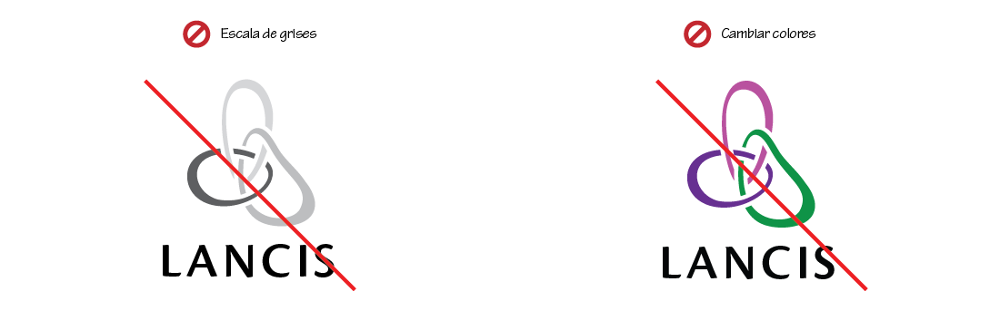

# Presentación

El presente manual es una guía de uso para la identidad institucional del Laboratorio Nacional de las Ciencias de la Sostenibilidad (LANCIS). Debe servir también, como punto de partida para aplicaciones ulteriores que se puedan desarrollar. No es la intención de este documento utilizar terminología rebuscada que confunda a quien lo consulte, sino brindar una referencia al alcance de cualquier persona que permita comprender con facilidad cómo debe ser usado el logotipo institucional.

# Introducción

## El enlace borromeo

Aunque en ocasiones se le llame _nudo_ borromeo, se trata de un enlace, ya que está formado por más de un elemento. El enlace borromeo debe su nombre a la familia italiana que desde el siglo XV lo utilizó en su escudo de armas. El uso de este símbolo en la península italiana parece remontarse a un emblema de la ciudad de Cremona, de donde lo tomó Francesco Sforza para luego otorgarlo a la familia Borromeo (ca. 1450).

Al igual que muchas formas y símbolos de la humanidad, es posible encontrar enlaces de este tipo en figuras pertenecientes a distintas culturas y tiempos. El _Valknut,_ por ejemplo, es un símbolo nórdico formado por tres triángulos entrelazados a manera de aros borromeos; se utilizó en Suecia desde el siglo IX.

Este enlace tiene la particularidad de que un aro une a los otros dos, es decir, si retiramos uno, los otros dos dejan de estar unidos. Es por esto que se ha usado como representación de la _fuerza mediante la unión._

# El logotipo del LANCIS

Aunque su forma se inspire en elementos orgánicos (guijarros, hojas, gotas de agua), el logotipo del LANCIS es completamente abstracto, sin embargo, retoma la forma topológica de los aros borromeos para aprovechar las múltiples alegorías e interpretaciones que pueden desprenderse de esta figura como símbolo de unión. En el ámbito de las Ciencias de la Sostenibilidad hay varias interpretaciones posibles (tres ámbitos: biológico, económico y social; tres actores: gobierno, sociedad y academia; así como un laboratorio inicialmete conformado por tres unidades de investigación).

Los colores se escogieron pensando en asociaciones con la naturaleza: verde y azul claro, incorporando además el azul oscuro distintivo de la UNAM, sede del LANCIS.

El logotipo, como ya dijimos, es una abstracción, todas estas interpretaciones no se deducen por sí solas, más bien surgen de nuestra propia visión institucional.

Como norma, se usarán dos versiones principales: el logotipo oficial (formado por el símbolo y el nombre) y la versión extendida con el nombre completo de la institución.

Una tercera versión, extendida vertical, se usará solo cuando la disposición horizontal no convenga a la composición.

# Elementos y terminología básica

El logotipo esta compuesto por dos elementos inseparables: el símbolo y la tipografía. Es importante comprender esta idea de unidad ya que nunca se presentan dichos elementos por separado.

En la versión extendida del logotipo, se utiliza además, una pleca vertical y otro elemento tipográfico que resulta de poner el nombre completo de la institución.

# Colores

Utilizamos cuatro colores, tres para cada uno de los aros y negro para la tipografía. Se proporcionan valores para los cuatro principales modelos de color.

La elección de cada modelo dependerá del destino final que se requiera. En general, el catálogo Pantone y el modelo CMYK (valores de cian, magenta, amarillo y negro), se usan en procesos de impresión; mientras que el sistema hexadecimal y RGB (rojo, verde, azul), sirven para desplegarse en pantalla.

# Proporciones

Mostramos las proporciones y la retícula de las tres versiones del logotipo, tomando como módulo _(x)_ la altura de una mayúscula.

# Área de protección

El área de protección es el espacio mínimo que debe quedar libre alrededor del logotipo, esto con la finalidad de que se lea bien y visualmente no compita cuando se use junto con otros logotipos o elementos de diseño.

# Tamaño mínimo

Se refiere al tamaño mínimo en que deba reproducirse el logotipo para asegurar buena legibilidad, tanto en impreso como en pantalla. Se proporcionan los valores en centímetros y pixeles para ambas presentaciones.

# Fuentes tipográficas

El logotipo utiliza la fuente Cronos Pro distribuída por Adobe. Esta fuente cuenta con una amplia variedad de pesos, en nuestra imagen utilizamos solo tres: _Semibold Display_ para el nombre, _Light_ para las versiones extendidas y _Light Caption_ para las versiones caladas.

El _track_ corresponde al ajuste óptico utilizado en el espaciado de las letras.

## Fuentes auxiliares

Las fuentes auxiliares son las que utilizaremos en documentos y plantillas generados en el LANCIS. Se proponen dos fuentes auxiliares: Chaparral Pro distribuida por Adobe y Calibri de distribución gratuita con el sistema operativo Windows. Se utilizan principalmente los pesos _Light_ para cuerpo de texto y _Semibold_ y _Bold_ para títulos.

# Variantes permitidas

Se deberán privilegiar la versión en color sobre fondo blanco y la versión extendida horizontal.

La versión extendida vertical, como ya se mencionó, será de uso excepcional y podrá usarse solo cuando así convenga a la composición.

En casos especiales que así lo requieran, se permitirá el uso de variantes en blanco sobre fondo oscuro (calados).

 

Se consideran también variantes monocromáticas en negro sobre fondo claro.

# Usos incorrectos

Parte importante de este manual consiste en especificar qué usos del logotipo **no** están permitidos. A continuación se muestran algunos de los casos más importantes:

- No usar los colores en escala de grises ni cambiar o modificar colores

- No modificar proporciones

- No usar el símbolo sin la tipografía.
- No inclinar

- No cambiar la posición de la tipografía o cambiar la fuente tipográfica

- No añadir elementos (como ornamentos, marcos, etc.) o agregar sombras o efectos

- No usar como patrón repetido o calar sobre un fondo que no sea contínuo

